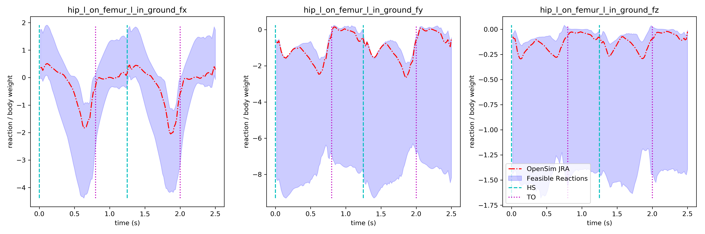

Feasible Joint Reaction Analysis
---

This method calculates the feasible joint reaction loads of a musculoskeletal
model. It is an extended version of the OpenSim's joint reaction analysis, that
accounts for different realizations of muscle forces that produce the same
movement (null space solutions). This type of analysis is useful for
investigating the bounds of the reaction loads.

The concept of this analysis is as follows:

1. find a particular solution of muscle forces that achieves the recorded
movement

2. sample the muscle force null space using vertex enumeration techniques and
calculate the feasible muscle forces (step 1)

3. perform multiple joint reaction analyses for each different muscle force
realization to calculate the joint loads

The python folder contains Python scripts that are compatible with the new
version of OpenSim (v4.0). The Gait10dof18musc dataset was used in the python
code because it has less muscles and the sampling of the feasible space is fully
exploited. Please open the following notebook to run the algorithm:

[Interactive Jupyter Notebook](file:python/feasible_joint_reaction_loads.ipynb)

Required Data
---

- The scaled model, using a static pose to fit anthropometrics (results from
  OpenSim Scaling tool)

- The marker trajectories of the motion in OpenSim .trc file format

- Ground reaction forces in OpenSin .mot file format

Results
---

Results are pre-computed and stored in the dataset/xxx/notebook_results/fig folder.

